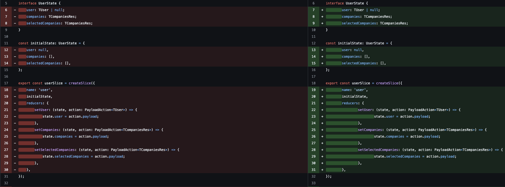

# Why not use eslint for formatting ?

[`Go to original Readme`](./OriginalReadme.md)

## What is this ?

This repo shows minimal setup for using eslint for both linting and formatting in react. Works in **`ts`**, **`js`**, **`tsx`**, **`jsx`** files

## Why not prettier

Prettier is a great tool for formatting but what it misses is consistency with eslint rules. It is tedious to make prettier config as similar as eslint rules. You need to control in both (spacing, line breaks, brackets, indentation, etc). As an example

I described my own hard times here with prettier + eslint, you can find more resources below

## Downside

While prettier formats css out of the box, you need to install additional plugins in eslint

## Helpful resources

- [Why eslint stylystic ?](https://eslint.style/guide/why)
- [Anthony Fu's Why I don't use Prettier](https://antfu.me/posts/why-not-prettier)

## Conclusion

Even though i changed my default formatter from prettier to eslint in vscode user settings, you can still use this repo to test its formatting even if you have prettier as a default formatter.